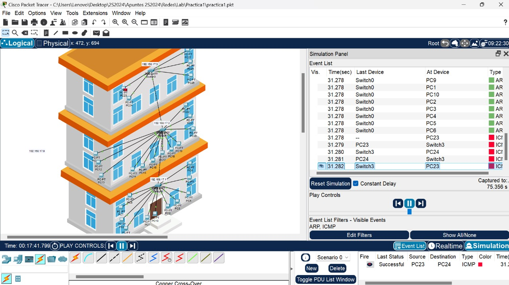

# Manual Técnico - Práctica 1

## Integrantes del Grupo
- 👨🏻‍💻 Julio Alfredo Fernandez Rodriguez 1 - Carnet
- 👩🏻‍💻 Sharon Estefany Tagual Godoy 		  - Carnet
- 🐶 Albertt Wosveli Itzep Raymundo 	  - 201908658

## 1. Descripción General

Este documento describe el diseño y la configuración de una red local utilizando Cisco Packet Tracer, la red simula un pequeño negocio de tres niveles, con una topología en estrella y equipos VPC distribuidos en diferentes áreas como administración, gerencia, atención al cliente, recursos humanos, entre otras.

## 2. Topología de la Red

### 2.1. Descripción de la Topología

- **Tipo de topología**: Estrella
- **Niveles**:
  - Nivel 1: Administración, Gerencia, Atención al Cliente, Recursos Humanos
  - Nivel 2: Oficinas A, B, C
  - Nivel 3: Recepción, TI, Ventas

## 2. Configuración de las VPCs

A continuación se presenta la configuración de las VPCs en cada área.

### 2.1. Nivel 1 - Administración

- **Dirección IP**: `192.168.17.21`
- **Máscara de Subred**: `255.255.255.0`

### 2.2. Nivel 1 - Gerencia

- **Dirección IP**: `192.168.17.23`
- **Máscara de Subred**: `255.255.255.0`

### 2.3. Nivel 1 - Atención al Cliente

- **Dirección IP**: `192.168.xx.30`
- **Máscara de Subred**: `255.255.255.0`

### 2.4. Nivel 1 - Recursos Humanos

- **Dirección IP**: `192.168.17.26`
- **Máscara de Subred**: `255.255.255.0`

### 2.5. Nivel 2 - Oficina A

- **Dirección IP**: `192.168.17.4`
- **Máscara de Subred**: `255.255.255.0`

### 2.6. Nivel 2 - Oficina B

- **Dirección IP**: `192.168.17.7`
- **Máscara de Subred**: `255.255.255.0`

### 2.7. Nivel 2 - Oficina C

- **Dirección IP**: `192.168.17.13`
- **Máscara de Subred**: `255.255.255.0`

### 2.8. Nivel 3 - Recepción

- **Dirección IP**: `192.168.17.16`
- **Máscara de Subred**: `255.255.255.0`

### 2.9. Nivel 3 - TI

- **Dirección IP**: `192.168.17.18`
- **Máscara de Subred**: `255.255.255.0`

### 2.10. Nivel 3 - Ventas

- **Dirección IP**: `192.168.17.17`
- **Máscara de Subred**: `255.255.255.0`

## 3. Pings entre los Hosts

A continuación se presentan las pruebas de conectividad realizadas entre diferentes áreas.

### 3.1. Ping 1: Administración ↔ Gerencia

*(Inserta aquí la captura de pantalla del resultado del ping )*

### 3.2. Ping 2: Atención al Cliente ↔ Recursos Humanos

*(Inserta aquí la captura de pantalla del resultado del ping entre )*

### 3.3. Ping 3: Oficina A ↔ Oficina B

*(Inserta aquí la captura de pantalla del resultado del ping)*

### 3.4. Ping 4: Recepción ↔ TI

*(Inserta aquí la captura de pantalla del resultado del ping )*

### 3.5. Ping 5: TI ↔ Ventas

*(captura de pantalla del resultado del ping )*

## 4. Captura de Paquete ARP/ICMP

A continuación se presenta la captura de un paquete ARP/ICMP.

### 4.1. Captura de Paquete

Captura de pantalla sobre la captura de mensaje por ICMP/RPA
