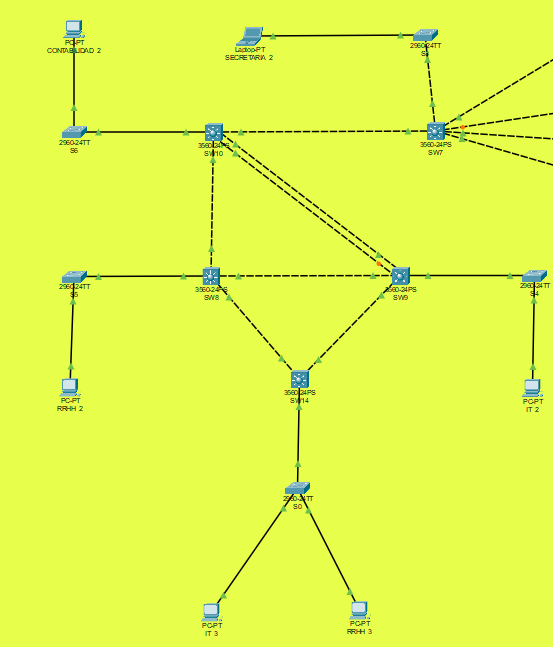

# Proyecto 1 - Redes de Computadoras

## Objetivos Generales
- Demostrar los conocimientos adquiridos sobre la creación y configuración de redes locales utilizando Packet Tracer.
- Implementar VLANs y Spanning Tree Protocol (STP) para evitar bucles y garantizar redundancia en la red.

## Objetivos Específicos
- Configurar **VLANs** para segmentar la red y mejorar la seguridad y el rendimiento.
- Implementar **Spanning Tree Protocol (STP)** para prevenir bucles y asegurar redundancia en la topología.
- Realizar simulaciones en **Packet Tracer** y capturas de paquetes con **Wireshark**.

## Descripción
La empresa **Solución al Cliente S.A.** requiere la creación de una red local para diferentes departamentos. Se debe asegurar que la red sea redundante y evitar bucles mediante la implementación de STP. Además, se debe segmentar la red utilizando **VLANs**.

Los departamentos y sus VLANs asignadas son:
- **Recursos Humanos (RRHH)** - VLAN ID: `1X`, Red: `192.168.1X.0/24`
- **Secretaría** - VLAN ID: `2X`, Red: `192.168.2X.0/24`
- **Contabilidad** - VLAN ID: `3X`, Red: `192.168.3X.0/24`
- **Informática (IT)** - VLAN ID: `4X`, Red: `192.168.4X.0/24`

> La 'X' representa el último dígito del número de carné de cada estudiante.

## Topología de Red


*Figura 1: Diagrama de la topología de red propuesta en Packet Tracer, mostrando los diferentes departamentos conectados a través de switches.*


### Áreas específicas
#### Área administrativa


#### Área central


#### Oficina A


### Verificación de configuracioens vtp
Para permitir la propagación automática de la configuración de VLAN entre switches en la misma red, manteniendo una configuración coherente en todos los dispositivos conectados a la red.


1. Comandos para VLAN y VTP:
    ```bash
    vtp domain [nombre_dominio] – Configura el dominio VTP.
    vtp mode [server|client|transparent] – Configura el modo VTP en el switch.
    vtp password [contraseña] – Establece una contraseña para VTP.
    vtp pruning – Habilita el pruning en VTP.
    vtp version [1|2|3] – Cambia la versión de VTP.
    show vtp status – Muestra el estado actual de VTP en el switch.
    show vlan brief – Muestra un resumen de las VLANs configuradas.
    vlan [número] – Crea una VLAN.
    name [nombre_vlan] – Asigna un nombre a la VLAN.
    interface [nombre_interfaz] – Entra en la configuración de la interfaz.
    switchport mode trunk – Configura un puerto en modo trunk.
    switchport trunk allowed vlan [número_vlan] – Especifica las VLANs permitidas en un trunk.
    switchport access vlan [número_vlan] – Asigna una VLAN a un puerto de acceso.
    ```


*Verificación de configuración.*

## Implementación de STP
### Configuración Básica de STP en Switches
Para habilitar el **Spanning Tree Protocol (STP)** y evitar bucles en la red, se debe configurar un **root bridge** en la red central:


1. Acceder al CLI del switch raíz y configurar el bridge:
    ```bash
    enable
    configure terminal
    spanning-tree vlan 1 root primary
    spanning-tree vlan 2 root primary
    spanning-tree vlan 3 root primary
    spanning-tree vlan 4 root primary
    ```

2. En los demás switches de la red, se puede verificar el estado de STP con:
    ```bash
    show spanning-tree
    ```

### Configuración de STP para Evitar Bucles
Se implementará **PVST+** (Per VLAN Spanning Tree) para las VLANs. El switch principal actuará como el **root bridge** y los switches adicionales serán configurados como **clientes**:

1. Configurar **STP PVST** en el switch principal:
    ```bash
    spanning-tree mode rapid-pvst
    spanning-tree vlan 1 root primary
    spanning-tree vlan 2 root secondary
    ```

2. Configurar **RSTP** (Rapid Spanning Tree Protocol) en switches adicionales:
    ```bash
    spanning-tree mode rapid-pvst
    ```

3. Verificar el estado de los puertos:
    ```bash
    show spanning-tree vlan 1
    ```

### Verificación de comunicación


### Verificación de Redundancia
Para probar la redundancia de la red, se debe desconectar un enlace entre switches y verificar que STP rerutea el tráfico a través de una ruta alternativa. Los comandos de verificación son:
```bash
show spanning-tree
show spanning-tree active
